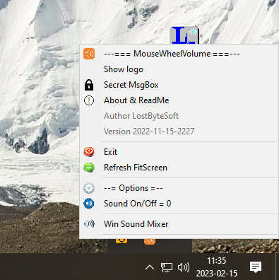

# MouseWheelVolume

Move mouse to tray bar and adjust the volume. That's it. Put your mouse OVER the taskbar. Your wheel mouse is now your volume control.
	
THANKS wOxxOm

From this : https://www.autohotkey.com/board/topic/7977-volumouse-trick-mouse-volume-control-over-taskbar-only/

Files and Use
--------------------------------------------------------------------
Mouse wheel up = +4 to volume

Mouse wheel down = -8 to volume

Versions
--------------------------------------------------------------------
2023-02-18 Update install and files

2023-02-16 Update readme file

2022-11-15 update to support win 11 x64

2017-11-25 first relaese for win 7 x64

Compatibility
--------------------------------------------------------------------
MouseWheelVolume_w7.exe for windows 7 x64

MouseWheelVolume.exe for others

Full list:

Windows 7 x64

Windows 8 x64

Windows 8.1 x64

Windows 10 x64

Windows 11 x64

Windows Server All x64

Options
--------------------------------------------------------------------
There are not really options.

Menu Tray
--------------------------------------------------------------------
The menu is in the tray ! There are no more menu anywhere.

Licence of use
--------------------------------------------------------------------

	End-user license agreement (eula)

 	JUST DO WHAT THE F*** YOU WANT WITH THE PUBLIC LICENSE
 	
 	Version 3.1415926532 (January 2022)
 	
 	TERMS AND CONDITIONS FOR COPYING, DISTRIBUTION AND MODIFICATION
    	
	Everyone is permitted to copy and distribute verbatim or modified copies of
 	this license document.
 	
 	As is customary and in compliance with current global and interplanetary
 	regulations, the author of these pages disclaims all liability for the
 	consequences of the advice given here, in particular in the event of partial
 	or total destruction of the material, Loss of rights to the manufacturer
 	warranty, electrocution, drowning, divorce, civil war, the effects of radiation
 	due to atomic fission, unexpected tax recalls or encounters with
 	extraterrestrial beings elsewhere.
 	
 	YOU MUST ACCEPT THESES TERMS OR NOTHING WILL HAPPEN.
 	
 	LostByteSoft no copyright or copyleft we are in the center.
 	
 	You can send your request and your Christmas wishes to this address:
 	
 		Père Noël
 		Pôle Nord, Canada
 		H0H 0H0

	LostByteSoft no copyright or copyleft.

--------------------------------------------------------------------
